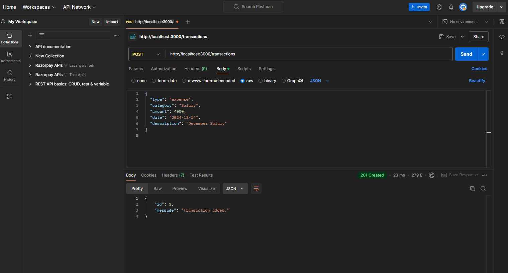
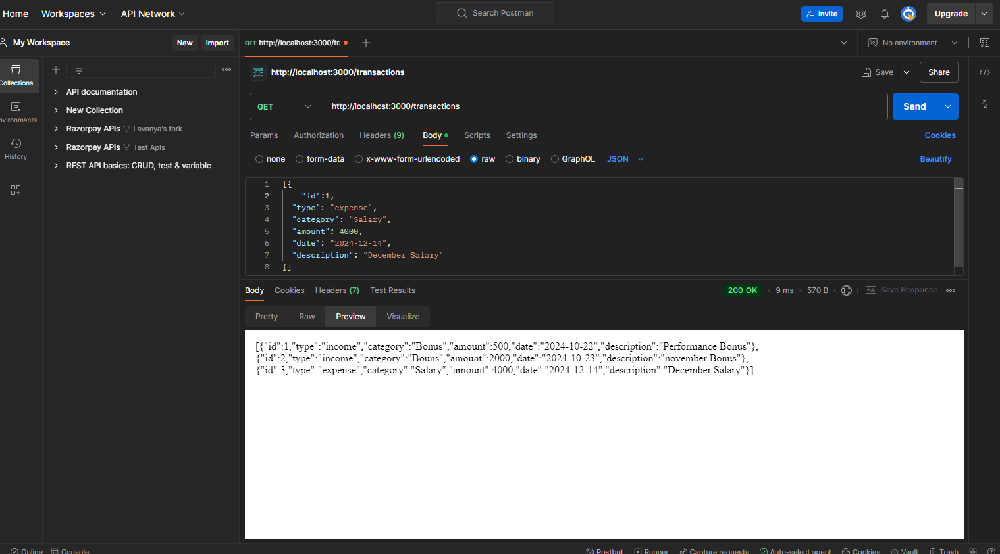
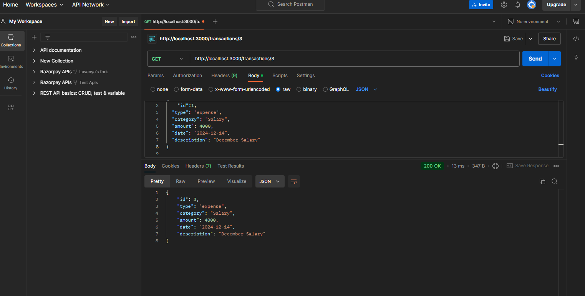
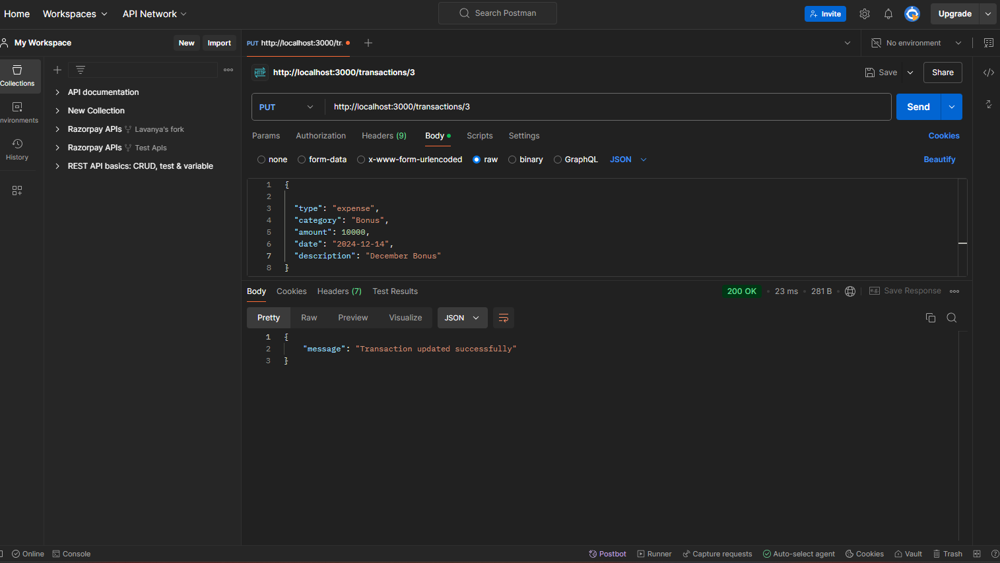
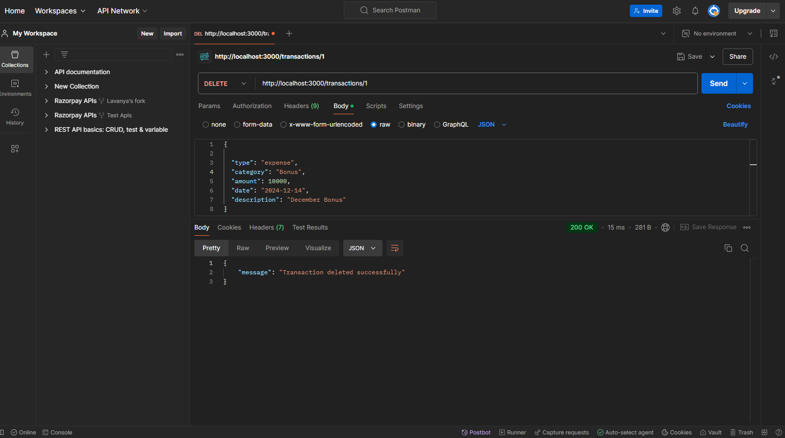

# Personal Expense Tracker API

This API allows users to manage their personal financial records.

## Instructions

1. Install Node.js and npm.
2. Install dependencies:

    "npm init -y"
    "npm install express sqlite3 body-parser"

3. To run the server:
    
    "node index.js"

4. Server is running on:
    
    http://localhost:3000/
    

API Documentation:

1. POST /transactions – ## Add a New Transaction ##
Request:
    {
    "type": "expense",
    "category": "Salary",
    "amount": 4000,
    "date": "2024-12-14",
    "description": "December Salary"
    }
Response:
    {
        "id": 3,
        "message": "Transaction added."
    }

2. GET /transactions - ## Get all the Transactions ##
Request:
    [
        {
    "type": "expense",
    "category": "Salary",
    "amount": 4000,
    "date": "2024-12-14",
    "description": "December Salary"
    }
    ]
Response:

    [
        {
            "id": 1,
            "type": "income",
            "category": "Bonus",
            "amount": 500,
            "date": "2024-10-22",
            "description": "Performance Bonus"
        },
        {
            "id": 2,
            "type": "income",
            "category": "Bouns",
            "amount": 2000,
            "date": "2024-10-23",
            "description": "november Bonus"
        },
        {
            "id": 3,
            "type": "expense",
            "category": "Salary",
            "amount": 4000,
            "date": "2024-12-14",
            "description": "December Salary"
        }
    ]
3. GET /transactions/  -## Retrieve a Transaction by ID ##

Request: 
    {
            "id": 3,
            "type": "expense",
            "category": "Salary",
            "amount": 4000,
            "date": "2024-12-14",
            "description": "December Salary"
        }
Response: 
        
    {
    "id": 3,
    "type": "expense",
    "category": "Salary",
    "amount": 4000,
    "date": "2024-12-14",
    "description": "December Salary"
}

4. PUT /transactions/ - ## Update a Transaction by ID ##
Request: 

    {

  "type": "expense",
  "category": "Bonus",
  "amount": 10000,
  "date": "2024-12-14",
  "description": "December Bonus"
}
response: 

5.  DELETE /transactions/ -## Delete a Transaction by ID ##

Request: Delete - http://localhost:3000/transactions/1
Respose: 